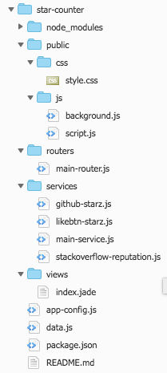
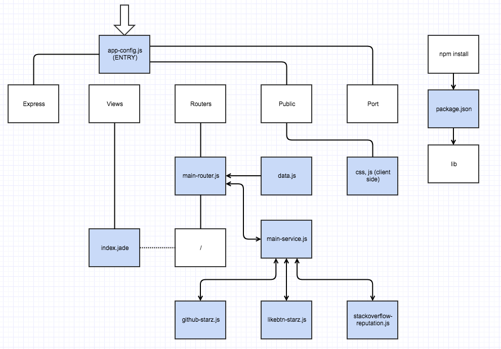
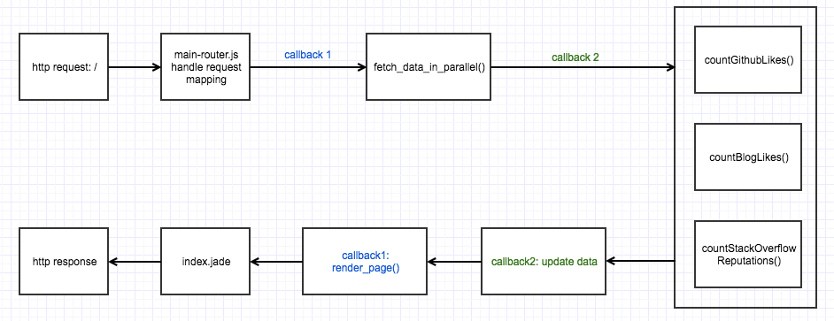

# Star Counter

As a software developer, there’s a lot of ways to measure his/her performance at work. But how to measure one’s achievement after work? I think this can be divided into three categories:

- Side Project
- Tech Blog
- Forum Activity

This web app get the following information and display with beautiful presentation:

- a user’s github likes
- a user’s tech blog likes
- a user’s stack overflow reputation

live demo click [here](link-to-do)

## Run instruction

- clone the project
- specify the input data in data.js
  - github username
  - likebtn email, api key, site id
  - stack overflow userid
- get dependencies: `npm install`
- run the web app: `node app-config.js`
- open web page in `localhost:8080`

## Teck Stack

- NodeJS for Javascript runtime engine
- Express for routing framework
- Heroku for deployment
- Git for code management
- Cloud 9 for IDE

## Design

File Structure

File Relationship

Request Workflow

## Reference

- use [async module](http://caolan.github.io/async/docs.html) to make several http requests in parallel
- use [starz](https://github.com/yyx990803/starz/blob/master/starz.js) for reference to count a github user's total stars
- use [zlib](https://nodejs.org/api/zlib.html) to decompress the api response from stack overflow
- github [api](https://developer.github.com/v3)
- likebtn.com [api](https://likebtn.com/en/like-button-statistics-api#api-stats)
- stack overflow [api](https://api.stackexchange.com/docs)
- [Understand JavaScript Callback Functions and Use Them](http://javascriptissexy.com/understand-javascript-callback-functions-and-use-them)

## Future Development

- add 2 weeks trend
- add direct link to each site